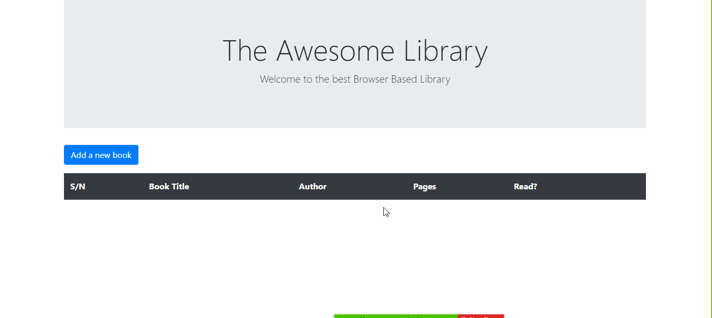

# Browser Based Library

 

  

  <h3 align="center">Browser Based Library</h3>

  

    A small Library app.
     
    <a href="https://github.com/Qoosim/Library-js/"><strong>Explore the docs »</strong></a>
     
     
    <a href="https://github.com/Qoosim/Library-js/issues/">Report Bug</a>
    ·
    <a href="https://github.com/Qoosim/Library-js/">Request Feature</a>
  

> A dead simple Javascript DOM Manipulation Library. Showcasing knowledge of `npm` and DOM manipulation.

## Built With

- Javascript
- Node
- Webpack 
- Bootstrap
- VSCode
- JSHint
- Github Actions

## Live Demo

[Live Demo Link](https://qoosim.github.io/Library-js/)

<!-- INSTALLATION -->
## Usage

- Visit the live link and enjoy !!! 
- You can download onto your machine and open `index.html`.
  
## Authors

👤 **Shingirayi Mandebvu**

- Github: [@simandebvu](https://github.com/simandebvu)
- Twitter: [@simandebvu](https://twitter.com/simandebvu)
- Linkedin: [linkedin](https://linkedin.com/in/simandebvu)

👤 **Qoosim AbdulGhaniyy**

- Github: [@Qoosim](https://github.com/Qoosim)
- Twitter: [@qoosim_ayinde](https://twitter.com/qoosim_ayinde)
- Linkedin: [linkedin](https://linkedin.com/in/qoosim)
- 
## 🤝 Contributing

Contributions, issues and feature requests are welcome!

Feel free to check the [issues page](issues/).

## Show your support

Give a ⭐️ if you like this project!

## Acknowledgments

- Microverse

## 📝 License

This project is [MIT](lic.url) licensed.
